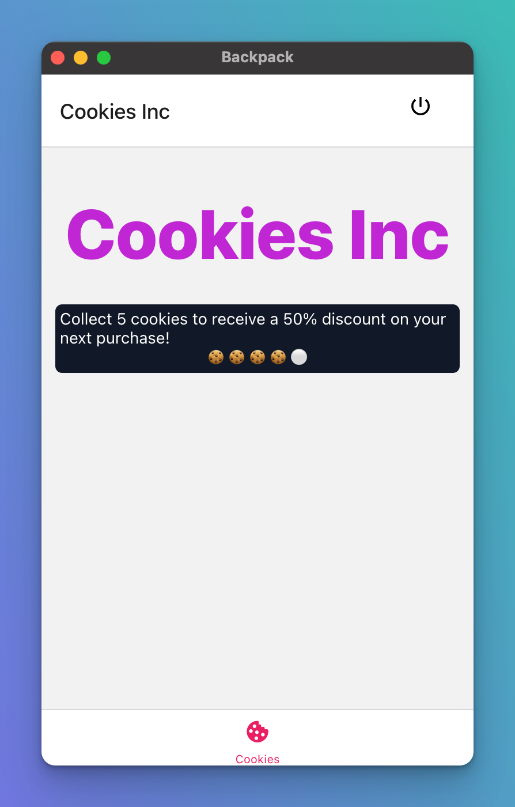
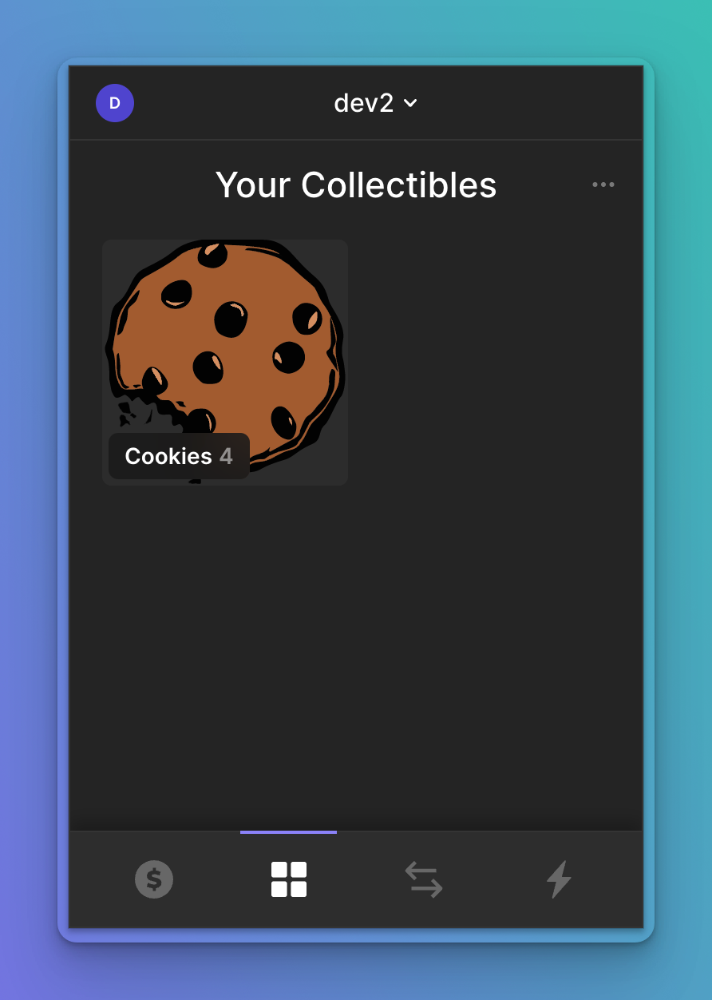
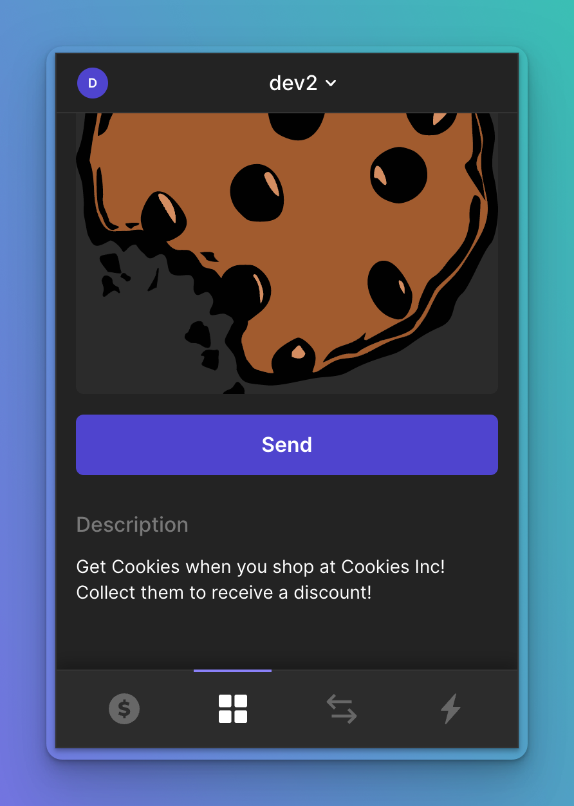

# Demo xnft: Cookies Inc

This repo shows a very simple example of a loyalty coupon being displayed in a custom way in an xnft



In this example I have a store that uses Solana Pay to implement an automated loyalty scheme. The user receives one cookie token with each purchase, and if they collect 5 then they get a 50% discount on their next purchase.

My loyalty token is stored on-chain as a semi-fungible token. This just means it doesn't have any decimals (you can't have eg. half a token) and tokens are interchangeable (unlike NFTs). It's just an SPL token with metadata. [You can see it in explorer](https://explorer.solana.com/address/6ECroWv425bgRZWj1wnMuFLhvvYRBseykKPaK3LH5exc?cluster=devnet).

Here's how it looks in a wallet that does a good job of displaying it:

| Collection View                                                     | Detail View                                                 |
| ------------------------------------------------------------------- | ----------------------------------------------------------- |
|  |  |

There are different token types and wallets can show the data in different ways, but there's always going to be a limit to what a wallet can do with the data it has about just our token

Xnfts offer one solution to this: a store-specific app that lives inside our wallet and can render whatever we like! It knows which wallet account has opened it so there's no connect step required to read our token balance.

---

## Developing

Once you've installed Backpack, get started building your xNFT with these steps. Note that the packages here will always use the latest, which correspond to the latest tagged build of Backpack. If you have unexepected issues, make sure your package versions match the app version.

Further documentation: https://docs.xnfts.dev/getting-started/getting-started

### Install

Make sure you use Node 16. You can run `nvm use` if using nvm.

First, install dependencies.

```
yarn
```

### Run the dev server

Then, run the dev server with hot reloading

```
yarn dev
```

### Open the Simulator in Backpack

Now that you have your xNFT dev server running, open it in the Backpack simulator to see it run.

That's it!

## Build & Publish

Once you're done and ready to publish, build your xNFT:

```
yarn build
```

Test the newly created build in `dist/index.html` in the simulator:

```
yarn start
```

Once everything looks good head over to [xnft.gg](https://www.xnft.gg) to publish your xNFT!
